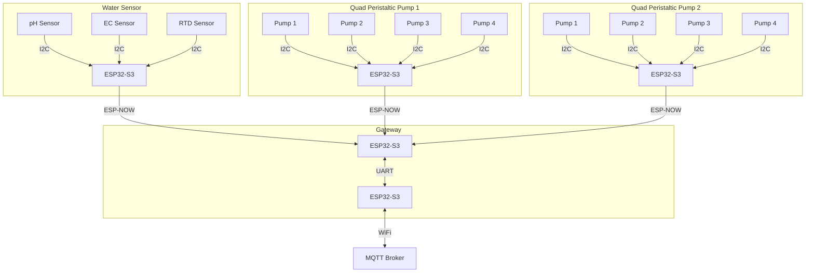
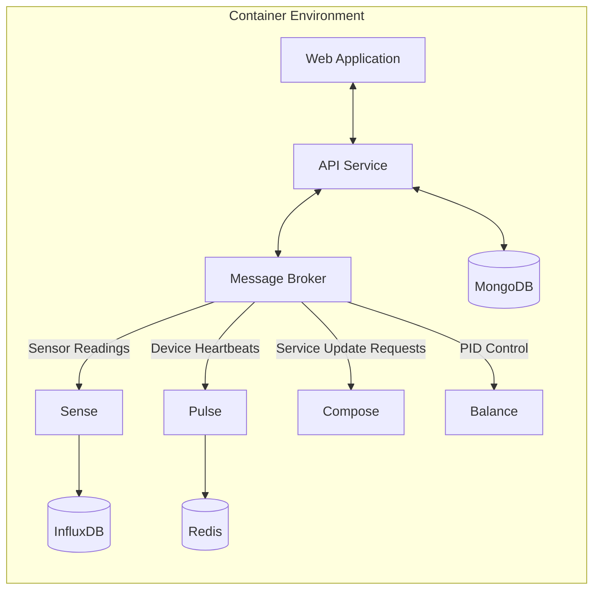

+++
title = "System Architecture"
type = "docs"
weight = 1
+++

## Overview

WolfControl is a complex system comprising various components that interact seamlessly to control and monitor all aspects of a controlled environment agriculture (CEA) system. This document provides a high-level overview of the system architecture and the interaction between different components.

## Communication: Clients and Gateways

Wolf Client devices interface with various sensors and actuators to control the environment. These client devices connect to a gateway over a 2.4GHz wireless network using the ESP-NOW protocol. Gateways aggregate data from all their client devices and communicates back to the WolfController over MQTT on WiFi, handling commands and lifecycle management for its clients.

## Microservices: WolfController

The WolfController is the heart of the WolfControl system, handling data processing, storage, system state management, and providing a user interface for configuration and monitoring. It runs as a set of microservices in Docker containers, hosted on a Raspberry Pi 5.

Sensor readings and device heartbeats are received by the message broker from the gateways (not shown in the diagram) and passed to the appropriate services for processing.

