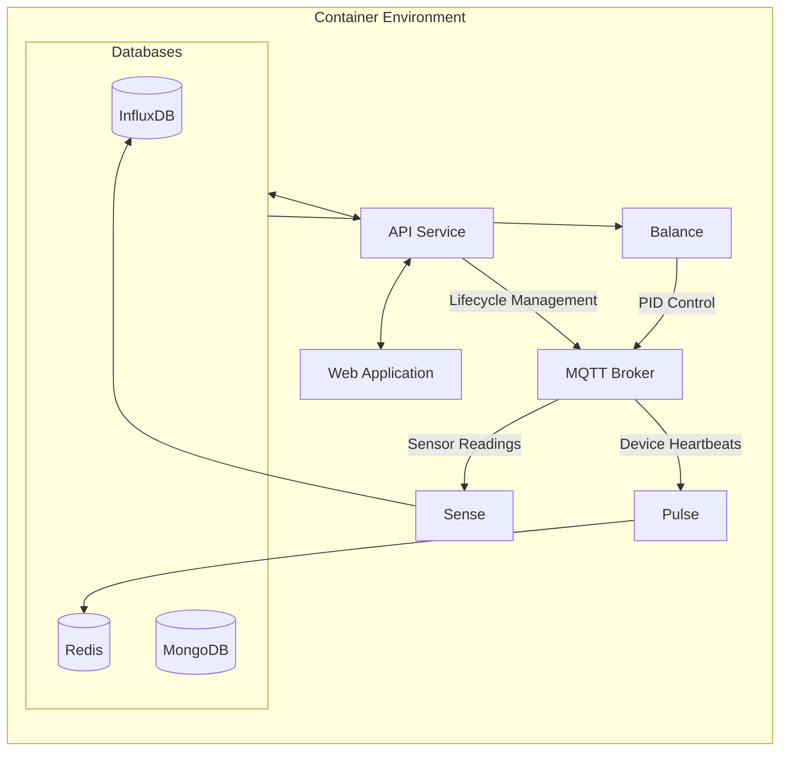

+++
title = "System Architecture"
type = "docs"
weight = 10
+++

## Overview

WolfControl is a complex system made up of many different components. This document aims to provide a high-level overview of the system architecture and how the different components interact with each other.

## Clients and Gateways

Wolf Client devices interface with various sensors and actuators to control the environment. Client devices connect to a gateway over a 2.4Ghz wireless network using the ESP-NOW protocol. The gateway is responsible for aggregating data from all the client devices and sending it to the WolfController over Wifi, as well as handling commands and lifecycle management for its clients.

## WolfController

The WolfController is the central hub of the WolfControl system. It handles all of the heavy lifting; processing and storing data, managing the system state, and providing a user interface for configuration and monitoring.

## Codebase

The WolfControl codebase can be split into 3 main categories: Firmware, Backend, and Documentation. Reusability is a key design principle; we make heavy use of libraries and frameworks to keep the codebase modular and maintainable. Each device firmware calls on a set of shared libraries for things like asynchronous task management, sensor reading, and communication with the gateway. Backend microservices rely on shared middleware for database access, logging, and more.

### Firmware

WolfControl devices are built around the ESP32-S3 microcontroller, with firmware written in C/C++ using the ESP-IDF framework. Firmware is made open source for ease of deployment, but the core business logic is kept proprietary in private libraries. Repositories are updated automatically when a new library release is created, triggering a new firmware release if the build is successful.

Some of the core libraries have been made open source and are available on GitHub:

- [esp-messaging](https://github.com/WolfControl/esp-messaging): Manages asynchronous messaging between devices.
- [esp-led](https://github.com/WolfControl/esp-led): Thin wrapper around the ESP-IDF LED control API.

### Backend

The backend controller for the WolfControl system is a Raspberry Pi 5 running Docker. A repo containing a docker-compose file and db configs is cloned onto the Pi for deployment.

Backend services are written in Go, and the frontend is vanilla JS. The same library based approach is used here, with go modules providing middleware for database access, MQTT communication, logging, etc. None of these libraries are available publicly at this time.

Services comprising the backend include:

- Pulse: Listens for device heartbeats and updates status in Redis.
- Sense: Listens for sensor readings and records them in InfluxDB.
- Balance: Implements PID control for maintaining setpoints.
- API: Provides a RESTful API for all system operations.
- WebApp: A simple web interface for system configuration and monitoring.
- MQTT Broker: Manages communication between devices and backend services.
- Loki: Log aggregation for backend services.
- Databases: InfluxDB, MongoDB, and Redis for storing data.

### Documentation

It's what you're reading right now! Documentation is written in Markdown and built using Hugo. The site is hosted on GitHub Pages and automatically deployed when changes are pushed to the main branch.

Various other repositories exist for things like hardware design, 3D models, and more. These are not covered in this document as they are all closed source at this time.
