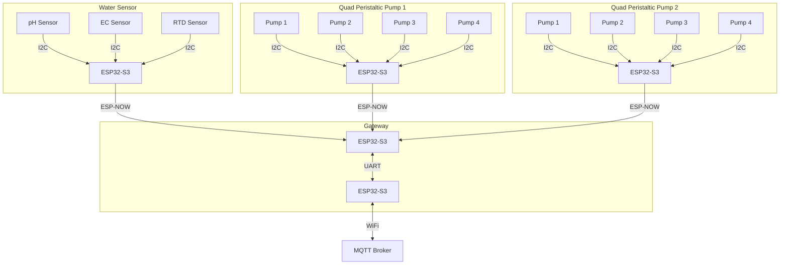
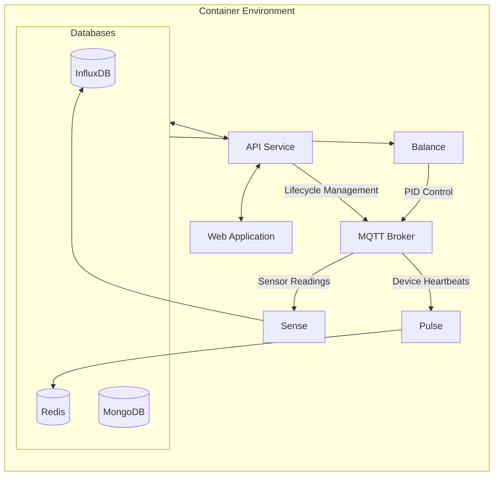

+++
title = "System Architecture"
type = "docs"
weight = 1
+++

## Overview

WolfControl is a complex system comprising various components that interact seamlessly to control and monitor all aspects of a controlled environment agriculture (CEA) system. This document provides a high-level overview of the system architecture and the interaction between different components.

## Clients and Gateways

Wolf Client devices interface with various sensors and actuators to control the environment. These client devices connect to a gateway over a 2.4GHz wireless network using the ESP-NOW protocol. The gateway aggregates data from all client devices and communicates with the WolfController over WiFi, handling commands and lifecycle management for its clients.

## WolfController

The WolfController serves as the central hub of the WolfControl system. It processes and stores data, manages the system state, and provides a user interface for configuration and monitoring.

## Codebase

The WolfControl codebase is divided into three main categories: Firmware, Backend, and Documentation. Reusability is a key design principle, leveraging libraries and frameworks to maintain modularity and ease of maintenance.

### Firmware

WolfControl devices are built around the ESP32-S3 microcontroller, with firmware written in C/C++ using the ESP-IDF framework. The firmware is open-source for ease of deployment, with core business logic kept proprietary in private libraries. Repositories are automatically updated with new library releases, triggering new firmware builds if successful.

Some core libraries are open-source and available on GitHub:

- [esp-messaging](https://github.com/WolfControl/esp-messaging): Manages asynchronous messaging between devices.
- [esp-led](https://github.com/WolfControl/esp-led): A thin wrapper around the ESP-IDF LED control API.

### Backend

The backend controller for the WolfControl system is a Raspberry Pi 5 running Docker. Deployment involves cloning a repository containing a Docker Compose file and database configurations.

Backend services are written in Go, while the frontend uses vanilla JS. A library-based approach ensures modularity, with Go modules providing middleware for database access, MQTT communication, logging, and more. None of these libraries are public at this time.

Backend services include:

- **Pulse:** Listens for device heartbeats and updates status in Redis.
- **Sense:** Listens for sensor readings and records them in InfluxDB.
- **Balance:** Implements PID control to maintain setpoints.
- **API:** Provides a RESTful API for all system operations.
- **WebApp:** A web interface for system configuration and monitoring.
- **MQTT Broker:** Manages communication between devices and backend services.
- **Loki:** Aggregates logs for backend services.
- **Databases:** InfluxDB, MongoDB, and Redis for data storage.

### Documentation

This documentation is written in Markdown and built using Hugo. The site is hosted on GitHub Pages and automatically deployed when changes are pushed to the main branch.

Additional repositories exist for hardware design, 3D models, and more, but these are closed-source and not covered in this document.
