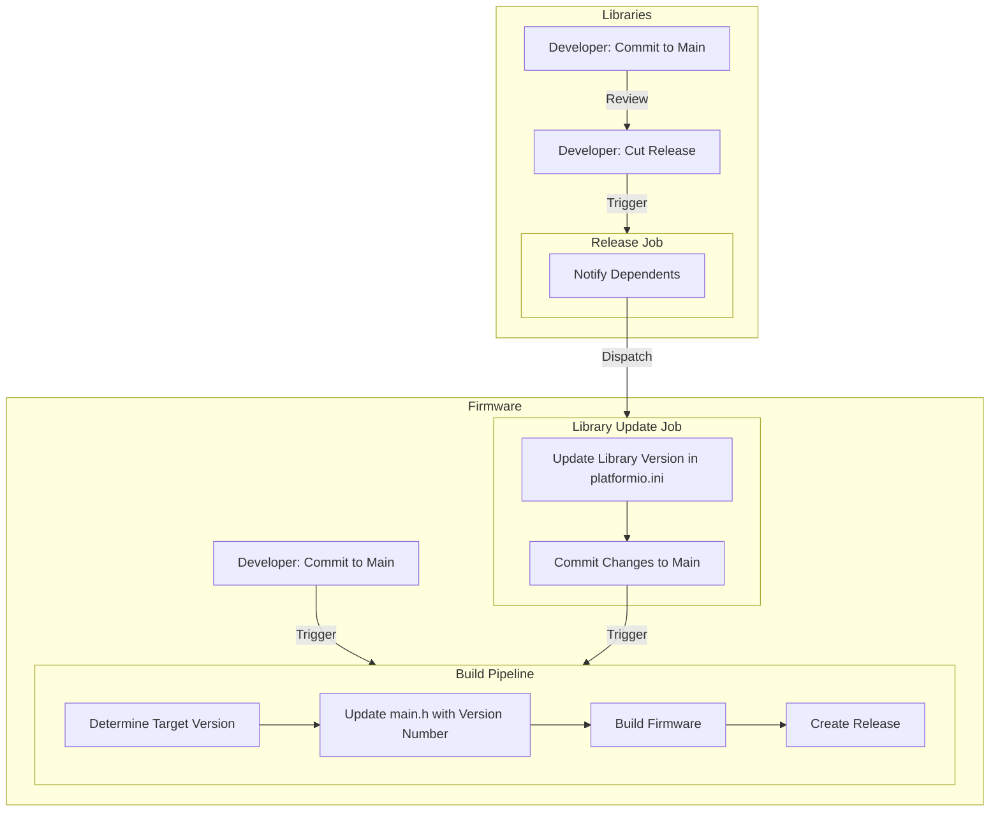
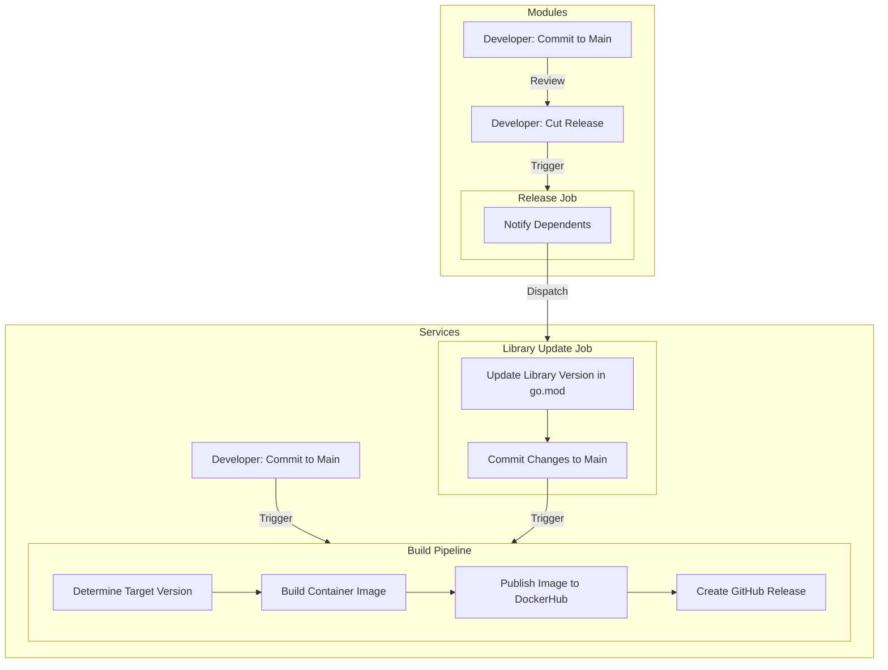
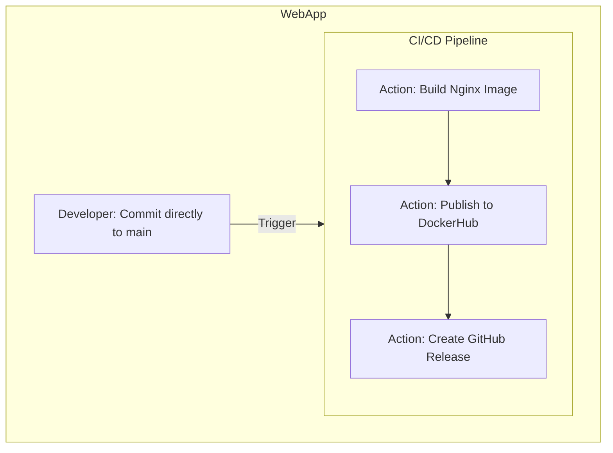
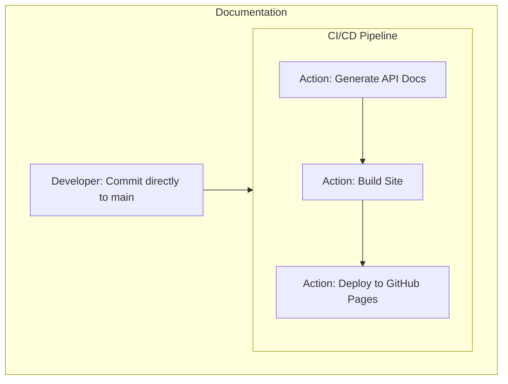

+++
title = "Design Patterns"
type = "docs"
weight = 2
+++

## Overview

As seen in [System Architecture](/developers/architecture), the WolfControl system is composed of a number of different components. To ensure seamless integration and functionality, a number of patterns and strategies have been implemented.

The codebase for WolfControl can be divided into 5 main categories:

1. Firmware - The code that runs on the actual hardware devices.
2. Firmware Libraries - Shared libraries used by all firmware.
3. Microservices - Backend services that run on the WolfController.
4. Go Modules - Middleware for the backend services.
5. Documentation - This documentation site, as well as 3D models, schematics, and other resources.

## Branch Strategy

WolfControl is developed by a single developer, so there is no need for complex branching strategies like GitFlow. Instead, all repositories use the trunk-based development strategy where all changes are made directly to the main branch. This simplifies the development process and allows for faster iteration.

New Repositories are configured with Actions secrets and an initial tag of v0.0.0.

## Continuous Integration & Deployment

Managing the multiple components of WolfControl requires a robust CI/CD pipeline, outlined below.

### Firmware & Libraries

WolfControl firmware written in C/C++ using the ESP-IDF framework. Firmware is open source to allow for easier fetching and deployment. The firmware libraries are shared across all firmware projects and are updated automatically when a new version is released. This build pipeline is also triggered on pushes to a firmware's main branch.

Some core libraries have been made open-source and are available on GitHub:

- [esp-messaging](https://github.com/WolfControl/esp-messaging): Manages asynchronous messaging between devices.
- [esp-led](https://github.com/WolfControl/esp-led): A thin wrapper around the ESP-IDF LED control API.

### Go Services & Modules

The backend services for WolfControl are written in Go and run in Docker containers. The services are built using a microservices architecture, with each service responsible for a specific task. Module releases and changes to service respositories both trigger the build pipeline.

### Webapp

The WolfControl webapp is built using vanilla JavaScript and runs in an Nginx container. Changes to the main branch trigger the build pipeline.

### Documentation

Documentation is written in Markdown and built using Hugo. The site is hosted on GitHub Pages and automatically deployed when changes are pushed to the main branch.

